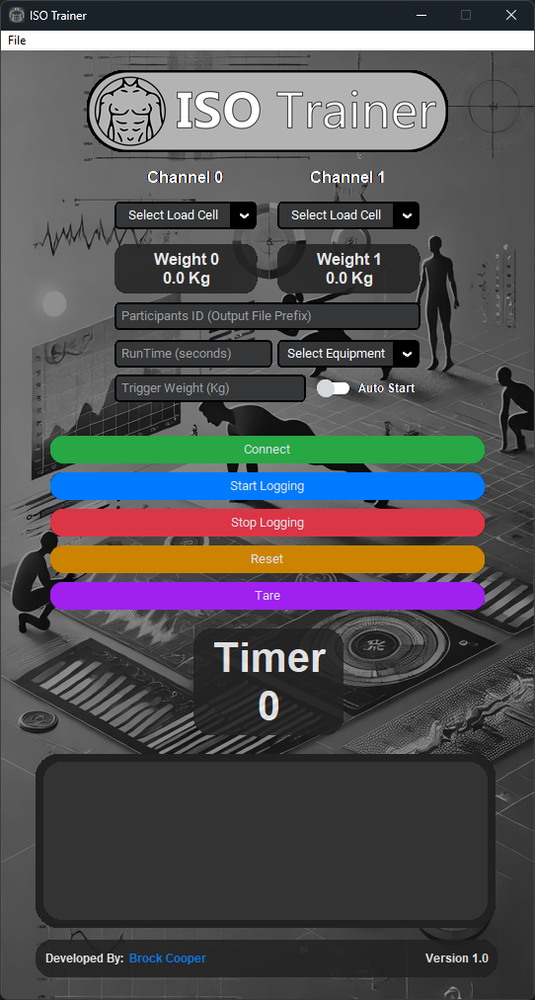
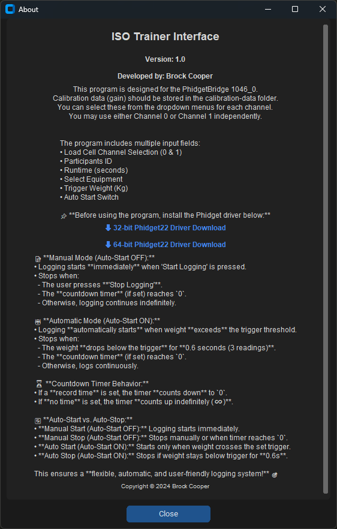

# ISOTrainer 💪
ISOTrainer is a graphical user interface (GUI) written in python designed for displaying live weight from 2 channel inputs on a [PhidgetBridge 4-Input](https://www.phidgets.com/?prodid=1027) device.   

The interface outputs the readings at a 5Hz interval. The data is logged to a CSV file within a folder called '_ISOTrainer-Logs_' located in the `ISOTrainer.exe` root directory. This folder will be created on the first time the program logs any data.

The program was designed for a study into Isometric Training which is a type of exercise that involves contracting a muscle or group of muscles without moving a joint. 

There is an `auto_exe_builder.py` file that allows you to compile and build the executable to run on machines that don't have python installed. This uses the pyinstaller python library.

# requirements.txt

- altgraph==0.17.4
- CTkMessagebox==2.7
- customtkinter==5.2.2
- darkdetect==0.8.0
- et-xmlfile==1.1.0
- hupper==1.12.1
- numpy==2.1.2
- openpyxl==3.1.5
- packaging==24.2
- pandas==2.2.3
- pefile==2024.8.26
- Phidget22==1.20.20240911
- pillow==11.1.0
- pyinstaller==5.13.2
- pyinstaller-hooks-contrib==2025.0
- python-dateutil==2.9.0.post0
- pytz==2024.2
- pywin32-ctypes==0.2.3
- pywinstyles==1.8
- six==1.16.0
- tzdata==2024.2