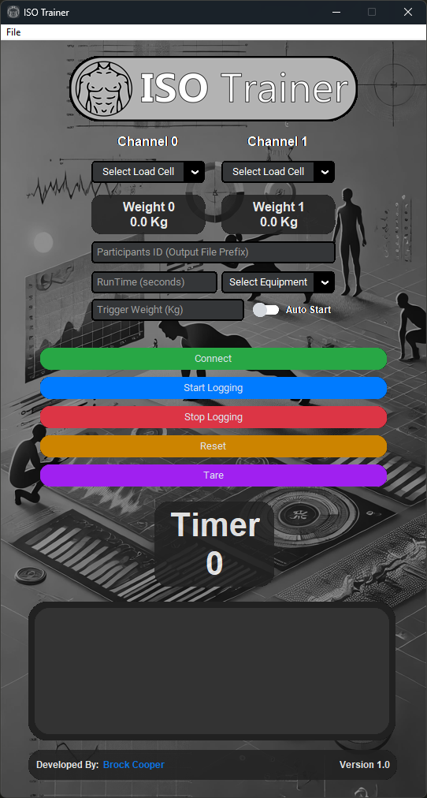
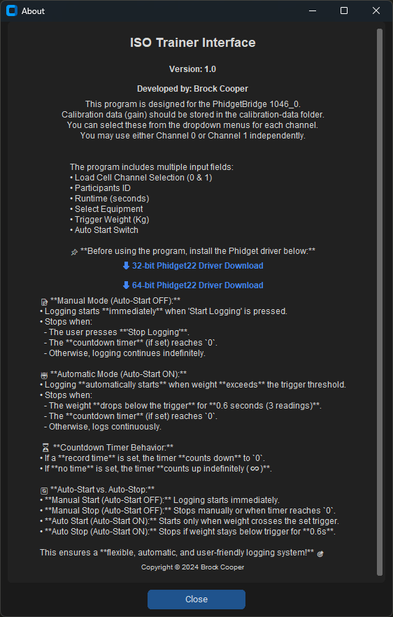

# ISOTrainer 💪
ISOTrainer is a graphical user interface (GUI) written in python designed for displaying live weight from 2 channel inputs on a [PhidgetBridge 4-Input](https://www.phidgets.com/?prodid=1027) device.   

The interface outputs the readings at a 5Hz interval. The data is logged to a CSV file within a folder called '_ISOTrainer-Logs_' located in the `ISOTrainer.exe` root directory. This folder will be created on the first time the program logs any data.

The program was designed for a study into Isometric Training which is a type of exercise that involves contracting a muscle or group of muscles without moving a joint. 

There is an `auto_exe_builder.py` file that allows you to compile and build the executable to run on machines that don't have python installed. This uses the pyinstaller python library.

# requirements.txt

- altgraph==0.17.4
- bottle==0.13.2
- cffi==1.17.1
- clr_loader==0.2.7.post0
- contourpy==1.3.1
- CTkMessagebox==2.7
- customtkinter==5.2.2
- cycler==0.12.1
- darkdetect==0.8.0
- et-xmlfile==1.1.0
- fonttools==4.56.0
- future==1.0.0
- hupper==1.12.1
- iso8601==2.1.0
- kiwisolver==1.4.8
- narwhals==1.29.0
- numpy==2.1.2
- openpyxl==3.1.5
- packaging==24.2
- pandas==2.2.3
- pefile==2024.8.26
- Phidget22==1.20.20240911
- pillow==11.1.0
- plotly==6.0.0
- proxy_tools==0.1.0
- pycparser==2.22
- pyinstaller==5.13.2
- pyinstaller-hooks-contrib==2025.0
- pyparsing==3.2.1
- PyQt5==5.15.11
- PyQt5-Qt5==5.15.2
- PyQt5_sip==12.17.0
- pyqtgraph==0.13.7
- python-dateutil==2.9.0.post0
- pythonnet==3.0.5
- pytz==2024.2
- pywebview==5.4
- pywin32-ctypes==0.2.3
- pywinstyles==1.8
- PyYAML==6.0.2
- six==1.16.0
- tkinterweb==4.0.6
- typing_extensions==4.12.2
- tzdata==2024.2